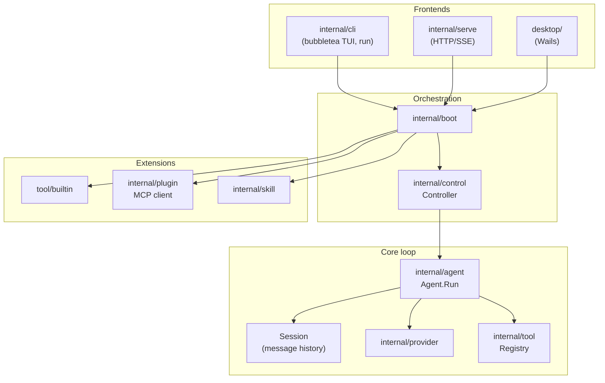

# Reasonix codebase guide

This document is a **reading guide** for contributors who want to understand how the Go rewrite fits together before changing it. It complements [CONTRIBUTING.md](../CONTRIBUTING.md) (build/test workflow) and [SPEC.md](./SPEC.md) (config and product contract).

---

## What this project is

**Reasonix** is a config-driven AI coding agent: one static Go binary that talks to LLM APIs, runs tools (read files, edit, bash, MCP plugins, sub-agents), and exposes that loop through several frontends (terminal TUI, `reasonix run`, HTTP `serve`, desktop app).

Design themes you will see everywhere:

| Theme | What it means in code |
|--------|----------------------|
| **Registries, not switches** | Providers and tools register by name; `main` blank-imports built-ins. No giant `switch model`. |
| **Config drives behavior** | `reasonix.toml` picks models, enabled tools, plugins, permissions, sandbox roots. |
| **Events, not formatted stdout** | The agent emits typed `event.Event` values; each frontend renders them. |
| **One assembly path** | `internal/boot` builds a `control.Controller` for CLI, serve, and desktop alike. |
| **Cache-stable prompts** | System prompt and tool schemas stay stable; plan mode gates writes at execute time instead of swapping prompts. |

---

## Start here: five files

If you only read five files to orient yourself:

| Order | File | Why |
|-------|------|-----|
| 1 | `cmd/reasonix/main.go` | Entry: wires built-in providers/tools, calls `cli.Run`. |
| 2 | `internal/cli/cli.go` | Subcommands (`chat`, `run`, `setup`, …) and how they call `boot.Build`. |
| 3 | `internal/boot/boot.go` | Turns config into provider + tool registry + permission gate + `Controller`. |
| 4 | `internal/control/controller.go` | Session driver: `Send`, approvals, compaction, branches — shared by all UIs. |
| 5 | `internal/agent/agent.go` | Core harness loop: stream → tool calls → results → repeat. |

After that, pick a vertical based on what you want to change (see [Where to dive next](#where-to-dive-next)).

---

## Layered architecture



**Dependency rule** (from CONTRIBUTING): `cli → {agent, plugin, config} → {tool, provider}`. Built-in subpackages register in `init()`; parents do not import children except via blank import in `main`.

---

## Request path: one user message

End-to-end flow for `reasonix chat` or `reasonix run "…"`:

1. **CLI** parses flags, loads config (`internal/config`), calls `boot.Build` with an `event.Sink` (TUI scrollback, plain stdout, etc.).
2. **boot** resolves `default_model` → `provider.Provider`, builds `tool.Registry` (built-ins + MCP tools + skill tools), installs `permission` gate and optional two-model **Coordinator** when `planner_model` is set.
3. **Controller** (`control.Send`) starts a turn: may run slash commands locally, resolve `@` attachments, then calls `agent.Run`.
4. **Agent.Run** (in `agent.go`):
   - Appends the user message to `Session`.
   - Loop (until final answer or `maxSteps`):
     - `stream()` → `prov.Stream()` with messages + tool schemas; emits `Reasoning`, `Text`, `ToolDispatch`, `Usage` events.
     - If the model returned tool calls → `executeBatch()` → each `tool.Execute()`; results become `RoleTool` messages.
     - If no tool calls → turn ends (possibly after final-readiness checks).
   - `maybeCompact()` may summarize old context when the window fills.
5. **Controller** emits `TurnDone`; frontend saves session JSONL, updates UI.

Headless `reasonix run` uses the same stack; the gate is non-interactive (deny still applies; `ask` may auto-decide).

---

## `internal/agent` — the harness

This package is the heart of “does the agent work.” Key types:

### `Agent`

- Holds `provider.Provider`, `*tool.Registry`, `*Session`, `event.Sink`.
- **`Run(ctx, input)`** — main loop (see above).
- **`stream`** — one LLM completion; accumulates tool calls from chunks.
- **`executeOne` / `executeBatch`** — permission gate, plan mode, hooks, sandbox context, then `Tool.Execute`.
- **Compaction** — `compact.go` rewrites middle of history when token ratio exceeds config.
- **Plan mode** — `SetPlanMode(true)` blocks non-`ReadOnly()` tools at execute time (prompt cache stays warm).

### `Session`

- Thread-safe `[]provider.Message` (system, user, assistant, tool).
- Compaction uses `Replace`; persistence uses `Snapshot` / save helpers in `save.go`.

### Sub-agents (`task.go`)

A common place to start reading because it is self-contained but touches the whole stack:

- **`TaskTool`** — built-in `task` tool; spawns a child agent with a **filtered** registry (meta-tools like `task`, `run_skill` excluded to prevent infinite nesting).
- **`RunSubAgent`** — `NewSession` + `New` + `Run` + return last assistant text only (tool trace stays out of parent context).
- **`NestedSink`** — forwards sub-agent `ToolDispatch`/`ToolResult` to the parent stream with IDs prefixed by parent call ID (UI nesting).
- **`FilterRegistry`** — also used by skills that run as subagents.

Background tasks use `internal/jobs` (`run_in_background` on `task` and bash).

### Other agent files worth knowing

| File / area | Role |
|-------------|------|
| `ask.go` | `ask` tool + `Asker` interface (controller implements in chat). |
| `branch.go` | Conversation branching / fork from checkpoints. |
| `compact.go` | Context summarization and archive dir. |
| `cache_shape.go` | Prefix-cache diagnostics (DeepSeek-style caching). |
| `*_test.go` | Best examples of expected behavior (`ask_test.go`, `loop_e2e_test.go`, `gate_test.go`). |

---

## `internal/control` — transport-agnostic UI backend

The **Controller** is what every frontend drives:

- Commands: send message, cancel, approve tool, set plan mode, compact, new session, branch/switch, MCP hot-add, etc.
- Owns: session dir, checkpoint store (`internal/checkpoint`), memory (`internal/memory`), slash commands (`internal/command`), skills list, hook runner.
- Implements **`agent.Asker`** and wires **`agent.Gate`** for interactive permission prompts.

If you add a feature that must work in **chat, serve, and desktop**, it usually belongs here or in `boot`, not in `cli` alone.

---

## `internal/tool` — capabilities the model calls

```go
type Tool interface {
    Name() string
    Description() string
    Schema() json.RawMessage
    Execute(ctx context.Context, args json.RawMessage) (string, error)
    ReadOnly() bool
}
```

- Built-ins live in `internal/tool/builtin/` and call `tool.RegisterBuiltin` in `init()`.
- **`ReadOnly() == true`** allows parallel execution with adjacent read-only calls in one batch (`partitionToolCalls` in `agent.go`).
- Writer tools may implement **`Previewer`** for approval UIs and checkpoint snapshots.
- Context helpers: `tool.WithProgress`, `agent.CallContext` (parent call ID + sink), `jobs.FromContext`, `memory.WithQueue`.

To add a built-in: see CONTRIBUTING § “Adding a new built-in tool”; grep an existing tool like `glob.go` or `readfile.go` for patterns.

---

## `internal/provider` — model backends

- **`Provider.Stream(ctx, Request)`** returns a channel of chunks (`ChunkText`, `ChunkToolCall`, `ChunkUsage`, …).
- **`Message`** mirrors OpenAI-style chat + tool messages; `SanitizeToolPairing` fixes interrupted sessions.
- Implementations: `provider/openai` (DeepSeek, MiMo, any OpenAI-compatible URL), `provider/anthropic`.
- Config `[[providers]]` entries use `kind = "openai"` etc.; resolved in `config.ResolveModel`.

---

## `internal/plugin` — MCP at runtime

Plugins from `[[plugins]]` or `.mcp.json`:

- **stdio** — subprocess JSON-RPC.
- **http** — Streamable HTTP MCP.

Tools appear as `mcp__<server>__<tool>`. Prompts become slash commands; resources become `@server:uri` references. See README “Plugins (MCP)” and SPEC § plugins.

---

## Configuration and policy

| Package | Responsibility |
|---------|----------------|
| `internal/config` | Load `reasonix.toml`, env expansion, legacy migration |
| `internal/permission` | allow / ask / deny rules; bash pattern matching |
| `internal/sandbox` | Workspace confinement for file writers; Seatbelt on macOS for bash |
| `internal/hook` | User shell hooks: PreToolUse, PostToolUse, PreCompact, … |
| `internal/memory` | `REASONIX.md` hierarchy, remember/forget tools |
| `internal/skill` | Markdown skills under `.reasonix/skills` etc. |

---

## Events: how the UI stays decoupled

`internal/event` defines **`Kind`** values: `TurnStarted`, `Reasoning`, `Text`, `ToolDispatch`, `ToolResult`, `Usage`, `ApprovalRequest`, `AskRequest`, `TurnDone`, compaction kinds, …

The agent never prints ANSI itself for structured output; it **`sink.Emit(event.Event{...})`**. The chat TUI (`internal/cli/chat_tui.go`, `textsink.go`, `toolcard.go`) subscribes and renders cards, spinners, and markdown.

When debugging “why didn’t the UI show X?”, trace whether the agent emitted the event and whether the sink implementation handles that `Kind`.

---

## Directory map (extended)

| Path | Notes |
|------|--------|
| `cmd/reasonix` | CLI binary |
| `cmd/reasonix-plugin-example` | Reference MCP stdio server |
| `cmd/e2ebench` | Benchmark harness |
| `internal/cli` | TUI, `run`, setup wizard, doctor, themes |
| `internal/serve` | HTTP API for remote/frontends |
| `internal/acp` | Agent Client Protocol bridge |
| `internal/command` | Slash commands + custom `.reasonix/commands/*.md` |
| `internal/checkpoint` | File snapshots for `/rewind` |
| `internal/lsp` | Optional LSP integration for tools |
| `internal/codegraph` | Code graph helper command |
| `internal/i18n` | EN/ZH strings |
| `desktop/` | Separate Go module; Wails UI calling same `boot`/`control` |
| `benchmarks/e2e` | Shell-based end-to-end tasks |
| `docs/SPEC.md` | Full product/schema spec |
| `docs/MIGRATING.md` | 0.x → 1.0 migration |
| `docs/CHECKPOINTS.md` | Rewind/branch persistence |

---

## Where to dive next

Choose a track based on your goal:

### “I want to fix/improve the agent loop”

1. `agent.go` — `Run`, `stream`, `executeOne`, `partitionToolCalls`
2. `compact.go` — context limits
3. Tests: `loop_e2e_test.go`, `dispatch_test.go`, `gate_test.go`

### “I want to add or change a tool”

1. `internal/tool/builtin/<tool>.go`
2. `internal/tool/builtin/builtin_test.go` or dedicated `*_test.go`
3. If the tool needs user input: `agent/ask.go` or permission patterns in `internal/permission`

### “I want to improve the terminal UI”

1. `internal/cli/chat_tui.go` — bubbletea model
2. `internal/cli/toolcard.go`, `md.go` — rendering
3. `internal/control/input.go`, `slash.go` — input and slash routing

### “I want MCP / plugins”

1. `internal/plugin/plugin.go`, transports `transport_stdio.go` / `transport_http.go`
2. `internal/boot/boot.go` — where plugins attach to the registry

### “I want models / streaming / retries”

1. `internal/provider/openai/openai.go`
2. `internal/provider/retry.go`

### “I want config or permissions”

1. `internal/config/config.go`
2. `internal/permission/permission.go`
3. `docs/SPEC.md` for field semantics

### “Sub-agents and delegation” (good first deep-dive)

1. `internal/agent/task.go` — full story in one file
2. `internal/skill/` — skills that call `RunSubAgent`
3. `internal/jobs/` — background `task` / bash

---

## Testing conventions

```bash
go test ./...                              # full suite
go test ./internal/agent/ -v -run TestAsk  # one package / test
```

- Prefer table-driven tests near the code they cover.
- `internal/agent/testutil/` — mock provider for loop tests.
- E2E: `internal/cli/*_e2e_test.go`, `benchmarks/e2e/tasks/`.
- Run `gofmt` before PR; CI uses `go vet` and lint (see CONTRIBUTING).

Reading tests is often faster than reading all production paths: they show minimal wiring and expected edge cases (e.g. `ask_test.go` for validation rules on the ask tool).

---

## Glossary

| Term | Meaning |
|------|---------|
| **Executor** | Primary model session that runs tools and produces the user-visible answer. |
| **Planner** | Optional second model (`planner_model`) for read-only planning before executor runs. |
| **Coordinator** | `control` wrapper when planner + executor are both configured. |
| **Turn** | One user message through `Agent.Run` until final assistant text or error. |
| **Step** | One LLM completion inside a turn (may include tool calls). |
| **Compaction** | Summarizing older messages to free context window. |
| **Gate** | Permission check before a tool runs. |
| **Sink** | Callback that receives `event.Event` values. |
| **Registry** | Name → `Tool` or provider factory map. |

---

## Suggested reading order (first week)

**Day 1 — skeleton:** `main.go` → `cli.go` (`Run`, `chatREPL`, `runAgent`) → `boot.go` (`Build`).

**Day 2 — loop:** `agent.go` (`Run`, `stream`, `executeBatch`) → `session.go` → skim `event/event.go`.

**Day 3 — one feature vertical:** e.g. `task.go` + `tool/builtin/grep.go` + `permission/permission.go`.

**Day 4 — UI path:** `control/controller.go` (`Send`) → `cli/chat_tui.go` (how events become screen).

**Day 5 — config contract:** `docs/SPEC.md` sections matching your change; add a test.

---

## Related docs

- [CONTRIBUTING.md](../CONTRIBUTING.md) — prerequisites, make targets, PR checklist
- [SPEC.md](./SPEC.md) — authoritative config and behavior contract
- [MIGRATING.md](./MIGRATING.md) — upgrading from 0.x TypeScript
- [CHECKPOINTS.md](./CHECKPOINTS.md) — rewind and branch files
- [README.md](../README.md) — user-facing features and install

If something in this guide disagrees with **SPEC.md**, trust SPEC.md and consider opening a PR to fix this guide.
